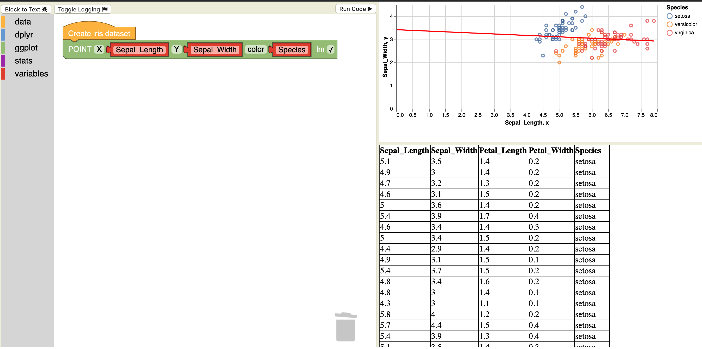

# TidyBlocks

  

Contributions of all kinds are welcome,
from translations and examples to bug fixes and new features.
Please see [our contributors' guide](CONTRIBUTING.md) for instructions.
By offering a contribution, you agree to abide by our [Code of Conduct](CONDUCT.md)
and that your work may be made available under the terms of [our license](LICENSE.md).

1.  To report a bug or request a new feature,
    please check the [list of open issues](https://github.com/tidyblocks/tidyblocks/issues)
    to see if it's already there,
    and if not,
    file as complete a description as you can.

1.  If you have made a fix or improvement,
    please create a [pull request](https://github.com/tidyblocks/tidyblocks/pulls).
    We will review these as quickly as we can (typically within 2-3 days).
