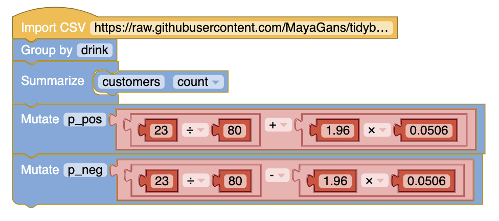
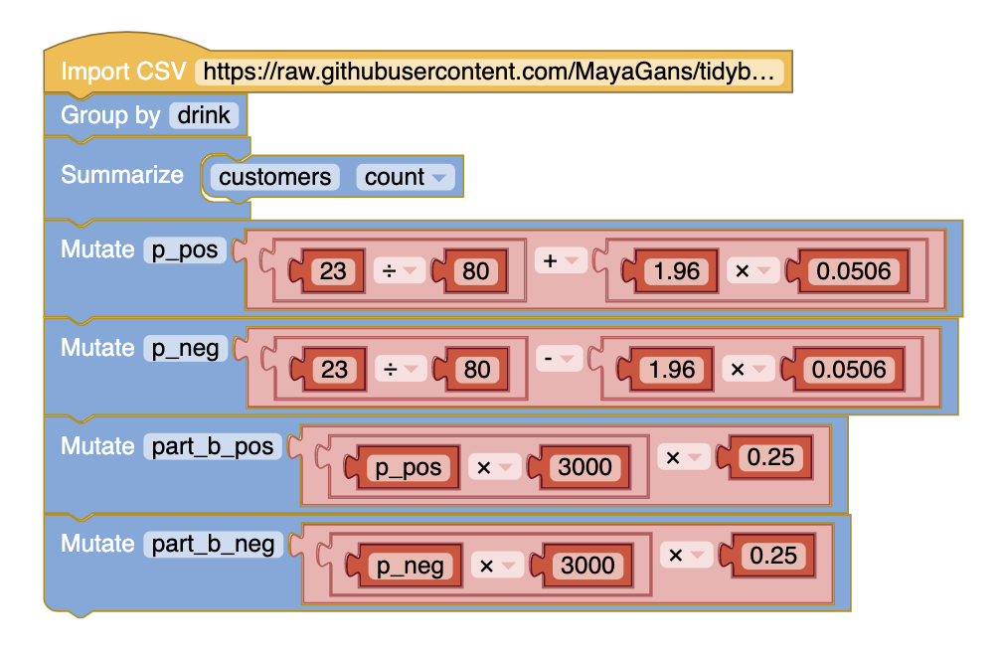

# 2017 Section II Part A 
https://secure-media.collegeboard.org/digitalServices/pdf/ap/ap17-statistics-q1.pdf

# Question 2

The manager of a local fast food restaurant is concerned about customers who ask for a water cup when placing an order but fill the cup with a soft drink from the beverage fountain instead of filling the cup with water. The manager selected a random sample of 80 customers who asked for a water cup when placing an order and found that 23 of those customers filled the cup with a soft drink from the beverage fountain.

#### (a) Construct and interpret a 95% CI for the proportion of all customers who having asked for a water cup when placing an order will fill the cup with a soft drink from the beverage fountain

# 

#### (b) The manager estimates that each customer who asks for a water cup but fills it with a soft drink costs the restaurant $0.25. Suppose that in the month of June 3000 customers ask for a water cup when placing an order. Use the confidence interval constructed in part (a) to give an interval estimate for the cost to the restaurant for the month of June from the customers who ask for a water cup but fill the cup with a soft drink.

# 