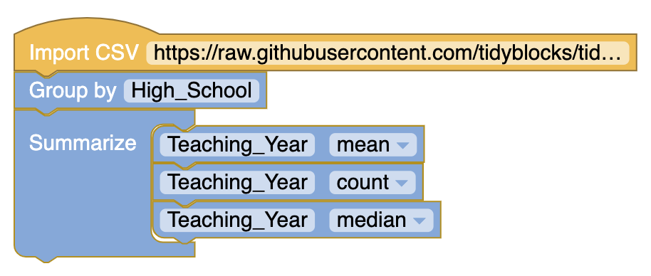
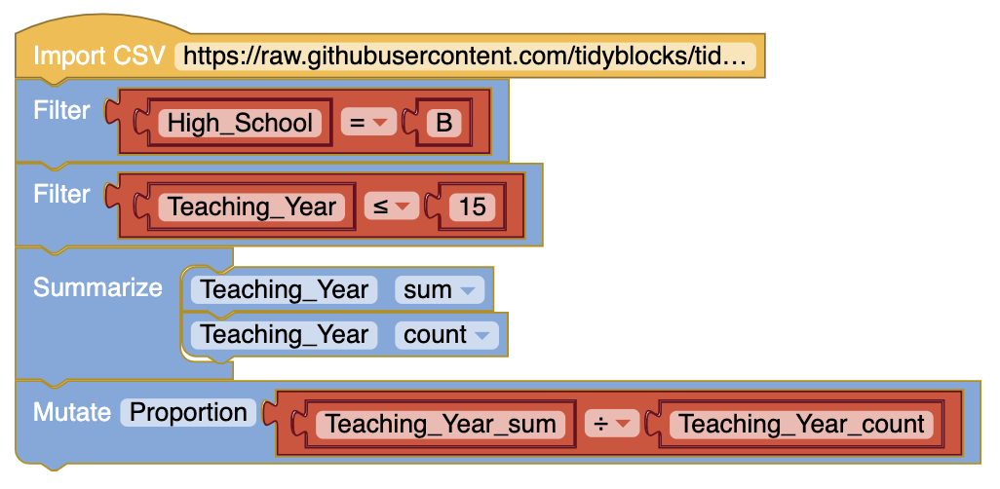

# 2018 Section II Part A 
https://secure-media.collegeboard.org/ap/pdf/ap18-statistics-q5.pdf

# Question 5

The following histograms summarize the teaching year for the teachers at two high schools, A and B.

Teaching year is recorded as an integer, with first-year teachers recorded as 1, second-year teachers recorded as
2, and so on. Both sets of data have a mean teaching year of 8.2, with data recorded from 200 teachers at High
School A and 221 teachers at High School B. On the histograms, each interval represents possible integer values
from the left endpoint up to but not including the right endpoint

#### (a) The median teaching year for one high school is 6, and the median teaching year for the other high school is
7. Identify which high school has each median and justify your answer:

#### (b) An additional 18 teachers were not included with the data recorded from the 200 teachers at High School A.
The mean teaching year of the 18 teachers is 2.5. What is the mean teaching year for all 218 teachers at High
School A?

#### (c) The standard deviation of the teaching year for the 221 teachers at High School Bis 7.2. If one teacher is
selected at random from High School B, what is the probability that the teaching year for the selected
teacher will be within 1 standard deviation of the mean of 8.2? Justify your answer.

# TidyBlocks Answer 

#### (a)

#### (b)

#### (c)

