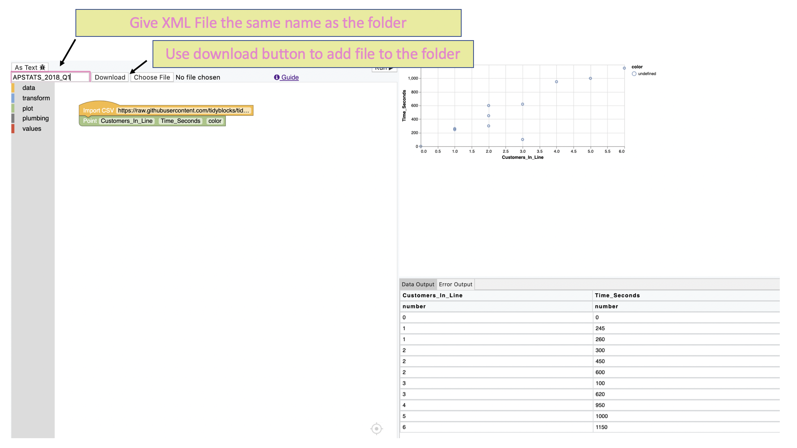

# Examples

This directory contains solutions using [tidyblocks.tech][tidyblocks]
to question from the [AP Statistics Exam][ap-stats]
and the [OpenIntro *Advanced High School Statistics*][openintro-hs] textbook.

## AP Stats Examples

When submitting a new example each folder should:

- Be named apstats_YYYY_qN, e.g., apstats_2018_q1

- Contain a README with:
  - A link to the question
  - The question
  - A link the dataset needed to answer the question
  - The TidyBlocks answer
  - A screenshot of the workspace used

- Contain an XML file downloaded from TidyBlocks so the workspace can be uploaded by others

- Contain a PNG screenshot of the finished solution

We are creating examples from the sample free response questions found at
<https://apstudents.collegeboard.org/courses/ap-statistics/free-response-questions-by-year>

| Question  | Completed |
| -------- | ---- |
| [2018_q1](https://github.com/tidyblocks/tidyblocks/tree/master/examples/apstats_2018_q1)  | A + B: regression blocks |
| [2018_q2](https://github.com/tidyblocks/tidyblocks/tree/master/examples/apstats_2018_q2)  | Done |
| [2018_q3](https://github.com/tidyblocks/tidyblocks/tree/master/examples/apstats_2018_q3)  | C: binomial block |
| [2018_q4](https://github.com/tidyblocks/tidyblocks/tree/master/examples/apstats_2018_q4)  | C: t-test block |
| [2018_q5](https://github.com/tidyblocks/tidyblocks/tree/master/examples/apstats_2018_q5)  | Done |
| [2018_q6](https://github.com/tidyblocks/tidyblocks/tree/master/examples/apstats_2018_q6)  | E: Help to Answer |
| [2017_q1](https://github.com/tidyblocks/tidyblocks/tree/master/examples/apstats_2017_q1)  | B + C: regression blocks |
| [2017_q2](https://github.com/tidyblocks/tidyblocks/tree/master/examples/apstats_2017_q2)  | Done |
| 2017_q3  | A: need qnorm block |
| 2017_q4  | A: need to add the ability to facet to recreate graph |
| 2017_q5  | TODO |
| 2017_q6  | TODO |
| 2016_q1  | TODO |
| 2016_q2  | TODO |
| 2016_q3  | TODO |
| 2016_q4  | TODO |
| 2016_q5  | TODO |
| 2016_q6  | TODO |
| 2015_q1  | TODO |
| 2015_q2  | TODO |
| 2015_q3  | TODO |
| 2015_q4  | TODO |
| 2015_q5  | TODO |
| 2015_q6  | TODO |

## OpenIntro *Advanced High School Statistics*

Examples are organized by chapter under open-intro-stats-hs.

[apstats]: https://apstudents.collegeboard.org/courses/ap-statistics/free-response-questions-by-year
[openintro-hs]: https://www.openintro.org/stat/textbook.php?stat_book=aps
[tidyblocks]: http://tidyblocks.tech
