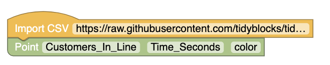

# 2018 Section II Part A 
https://secure-media.collegeboard.org/ap/pdf/ap18-statistics-q1.pdf

# Question 1

The manager of a grocery store selected a random sample of 11 customers to investigate the 
relationship between the number of customers in a checkout like and the time to finish checkout.
As soon as the selected customer entered the end of a checkout line, data were collected
on the number of customers in line who were in front of the selected customer and the time, in seconds,
until the selected customer was finished with the checkout. The data are shown in the following scatterplot
along with the corresponding least squares regression line and computer output.

#### (a) Identify and interpret in context the estimate of the intercept for the least sqaures regression line
#### (b) Identify and interpret in context the coefficient of determination
#### (c) One of the data points was determined to be an outlier. Which point is it, and explain why the point is considered an outlier.

# TidyBlocks Answer 

Using data in data/APSTATS_2018_Q1

