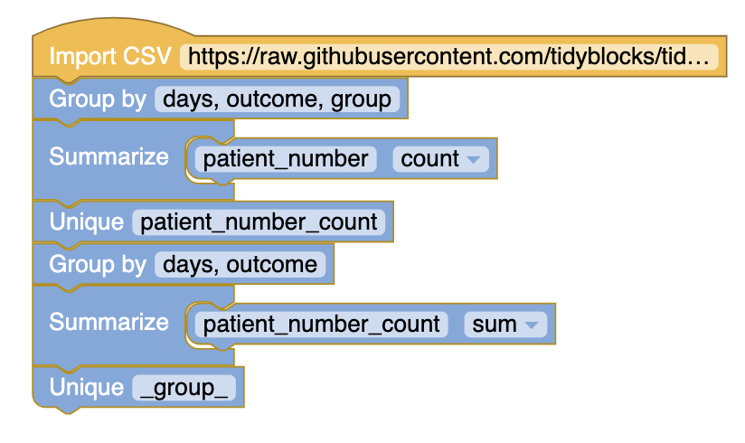
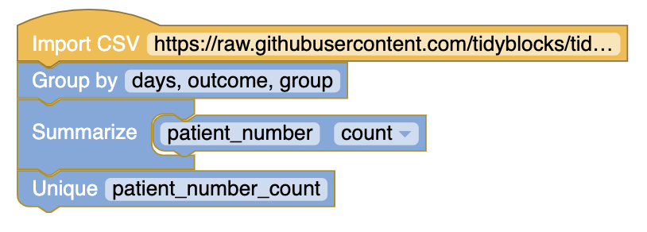

# Figure 1.2 
Using data from [Figure 1.1](https://raw.githubusercontent.com/MayaGans/tidyblocks-1/openintrostats/data/openintrostats/Figure_1_1.csv) aggregate data by when the measurement was taken, outcome and group. Then aggregate again to count for the total  outcomes per measurement time.

# Guided Practice
What proportion of the patients in the treatment group had no stroke within the first 30 days of the study?

# Calculate Proportions

