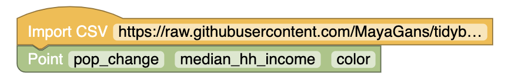

# Figure 1.8

A scatterplot of homeownership versus the percent of units that are in multi-unit structures for US counties

# Figure 1.9

A scatterplot showing pop change against median hh income.

# Guided Practice 1.7
What is the relationship between loan amount and total income?

If someone's income is above the average, will their interest rate tend to be above or below the average?

