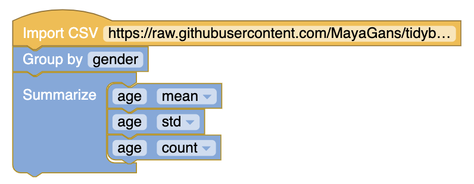

# Figure 2.27
Two bar charts: the left panel shows the counts, and the right panel shows the proportions in each group. (change the y_axis on bar block to obtain the other histogram)

# Figure 2.30
Need to group by format AND spam

# Exercise 2.35
The first Oscar awards for best actor and best actress were given out in 1929. The histograms below show the age distribution for all of the best actor and best actress winners from 1929 to 2018. Summary statistics for these distributions are also provided. Compare the distributions of ages of best actor and actress winners.52

(This can be reproduced for males by changing the filtering parameter)

# Exercise 2.37
Create a box plot of the 20 exam scores.

