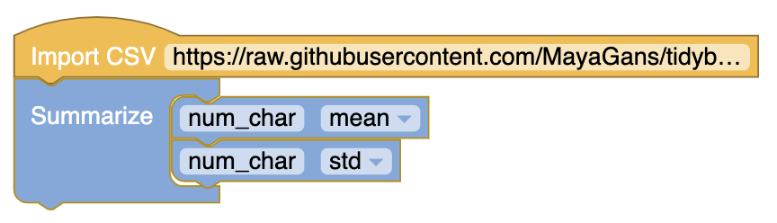
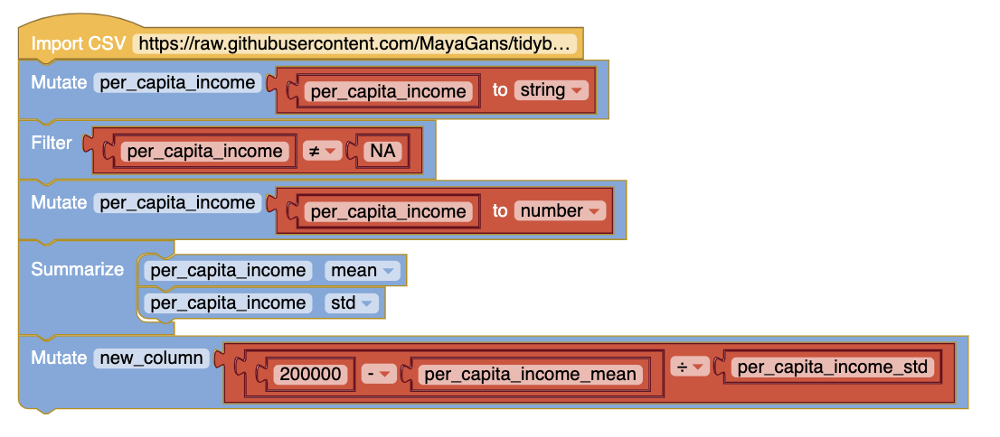
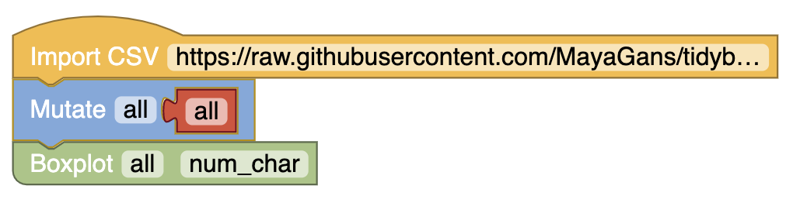

# Guided Practice 2.24
What was n in this sample of emails? What is the sample mean?

# Example 2.26

We might like to compute the average income per person in the US. To do so, we might first think to take the mean of the per capita incomes across the 3,142 counties in the county data set. What would be a better approach?

# Figure 2.12 
A histogram of num char with its mean and median.

# Section 2.2.3
Using the county data, find the per capita range

Using the email50 data find the mean and standard deviation

# Example 2.33
Consider that the mean family income in the U.S. and standard deviation. How many standard deviations above the mean is an income of $200,000?

# Figure 2.15
A labeled box plot for the number of characters in 50 emails. The median (6,890) splits the data into the bottom 50% and the top 50%.

# Example 2.41
Find the 5 number summary and identify how small or large a value would need to be to be considered an outlier. Are there any outliers in this data set?

# Figure 2.18
How are the sample statistics of the num char data set affected by the observation, 64,401? What would have happened if this email wasn’t observed? What would happen to these summary statistics if the observation at 64,401 had been even larger, say 150,000?

